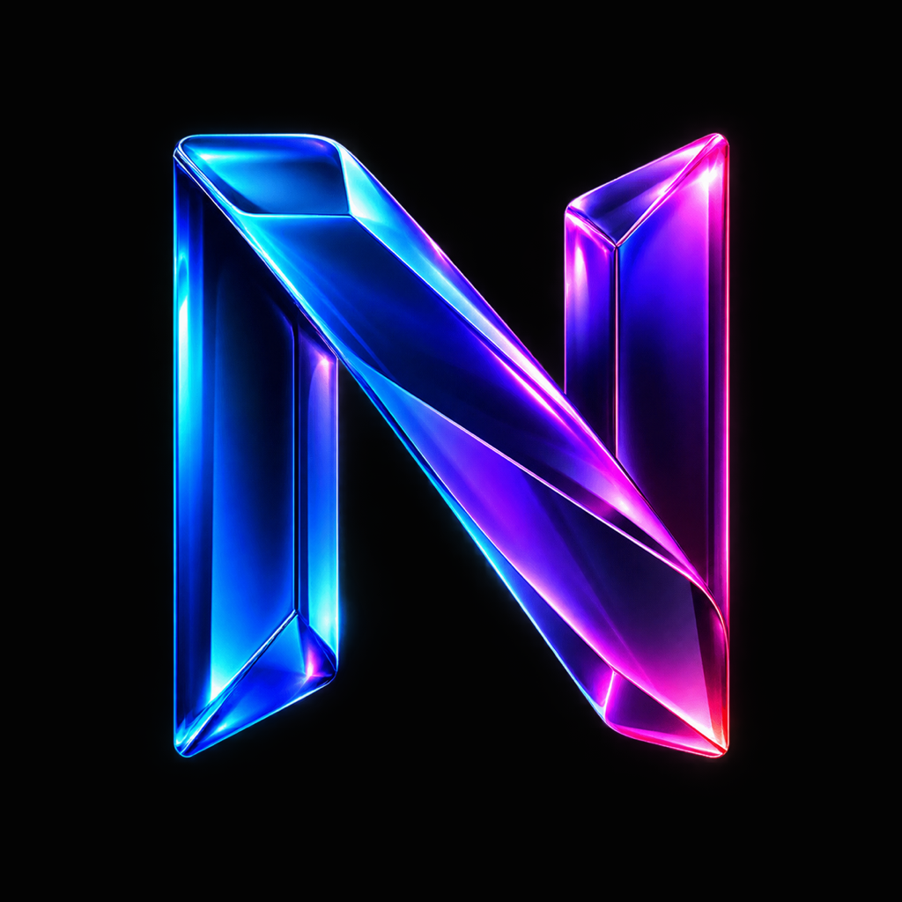

# Noiro

Noiro is an open-source, local-first media platform. This repository is the
public monorepo for Noiro Core, Noiro TV Engine integrations, and the native
clients for Android, iPhone, iPad, Apple TV, Mac, Linux, and Windows.

> **Early development preview.** The source is public, but this is not yet a
> production release. Platform parity, rights review, security review, signed
> packaging, and physical-device validation are still required before public
> binaries are distributed.



## Product boundary

| Area | Lives where |
|---|---|
| Playback, local servers, provider/debrid credentials, arbitrary manifests | Noiro device only |
| Profiles, Home-row order, appearance, language and playback preferences | Optional Noiro Sync |
| Purchases, entitlements, device approval, downloads, policies | Vortexo Shop, Library, and Studio |
| Media hosting or proxying | Nowhere in Vortexo |

The base app remains local and usable offline without an account. Noiro Pro is
planned to add Noiro Sync, Studio controls, and an opaque encrypted vault for up
to five devices. Pro expiry must never erase local data or the last verified
configuration.

## Repository map

| Path | Purpose |
|---|---|
| `noiro-core/` | Shared Rust core and engine-facing APIs |
| `app/` | Apple clients: iOS, iPadOS, tvOS, and macOS |
| `android/` | Android and Android TV client |
| `desktop/` | Desktop shell work for Linux and Windows |
| `webapp/` | Web client and development tooling |
| `vendor/kodi/` | Pinned source reference to the separate Kodi fork |

Kodi is intentionally maintained in
[`NoiroTV/noiro-kodi-engine`](https://github.com/NoiroTV/noiro-kodi-engine), a
fork of the upstream Kodi project. It is included here as a Git submodule so
Kodi updates stay reviewable and the upstream history remains intact. See
[`docs/KODI_UPSTREAM.md`](docs/KODI_UPSTREAM.md).

## Native projects

The Xcode project is generated from `app/project.yml`:

```sh
cd app
xcodegen generate
open Noiro.xcodeproj
```

Schemes:

- `Noiro` — iOS and iPadOS
- `NoiroTV` — tvOS
- `NoiroMac` — macOS

The current development identifiers are `com.elvissalihovic.noiro`,
`com.elvissalihovic.noiro.tvos`, `com.elvissalihovic.noiro.macos`, and the
shared group `group.com.elvissalihovic.noiro`. They are retained for build and
signing continuity and will only be migrated through a separately tested
release change.

Before building a customer package, read [Installation](docs/INSTALLATION.md),
[GPL source and distribution](docs/GPL_SOURCE_AND_DISTRIBUTION.md), and
[Release gates](docs/NOIRO_RELEASE_GATES.md). The website never asks for Apple
credentials and does not install directly onto an Apple TV.

## Noiro Sync

The app requests its own ten-minute pairing code and retains a private verifier.
Studio may approve the displayed code, but only the polling device can exchange
that approval for its one-time access token. Safe configuration is signed with
ES256. Optional private backup is encrypted on the device with AES-256-GCM; the
recovery key and plaintext never reach Vortexo.

## Licensing and support

The tracked source is GPL-3.0. Every future binary must be accompanied by its
exact corresponding source, dependency locks, build instructions, and SHA-256
checksums. GPL recipients retain redistribution rights. See
[Third-party notices](THIRD-PARTY-NOTICES.md).

Use [Noiro issues](https://github.com/NoiroTV/Noiro/issues) for bugs and feature
requests. Report security problems privately as described in
[SECURITY.md](SECURITY.md).
